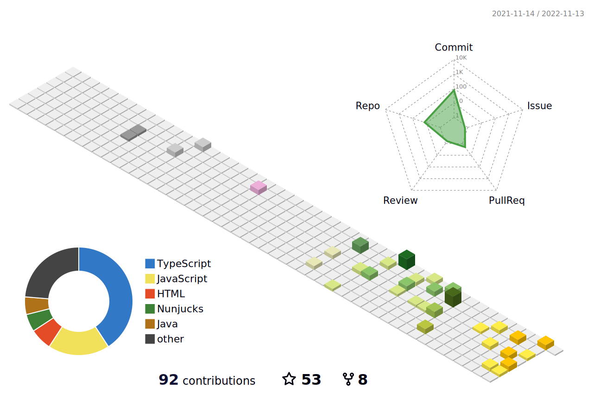

# Hello, I am Leandro, welcome to my github

#### A ambição sem conhecimento é como um barco em terra seca.
-Senhor Miyagi

 

  	

 
	

 

	&nbsp;&nbsp;&nbsp;
	&nbsp;&nbsp;&nbsp;
	&nbsp;&nbsp;&nbsp;
	&nbsp;&nbsp;&nbsp;
	&nbsp;
	&nbsp;&nbsp;
	&nbsp;&nbsp;&nbsp;
	&nbsp;&nbsp;&nbsp;
	&nbsp;&nbsp;&nbsp;
	&nbsp;&nbsp;&nbsp;
	&nbsp;&nbsp;&nbsp;
	&nbsp;&nbsp;&nbsp;
	&nbsp;&nbsp;&nbsp;

